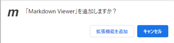
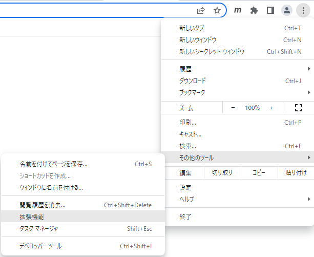

# MarkDown ファイルの利用設定

MarkDownファイル（***.md ファイル）を表示するための設定方法

# Google Chrome の MarkDownファイルの表示対応設定

## Chromeウェブストア で拡張機能 Markdown Viewer をインストールする

下記URLへChromeから下記URLへアクセスし、[Chromeに追加]ボタンを押下する。

https://chrome.google.com/webstore/detail/markdown-viewer/ckkdlimhmcjmikdlpkmbgfkaikojcbjk?hl=ja-jp

  

「Markdown Viewer」を追加しますか？ の質問に対し [拡張機能を追加] ボタンを押下する。

  

## インストールした拡張機能の詳細設定

Chromeで、MarkDownファイルのリンク画像の表示に対応させるため、追加した拡張機能に以下の設定をする。

Chromeの画面右上の設定アイコンより [その他のツール] → [機能拡張] を選択し [Markdown Viewer] が有効になっていることを確認し [詳細] ボタンを押下する。

  
  

詳細画面の [ファイルのURLへのアクセスを許可する] のチェックを ON にする。

  

以上で、Google Chrome の MarkDownファイルの表示対応設定は完了。
***.mdファイル をChromeの画面にドラッグ＆ドロップすればファイルを表示することが可能。
